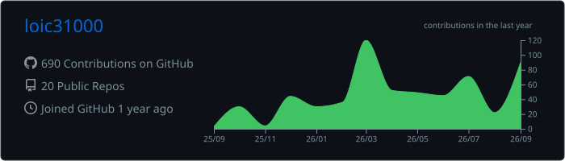
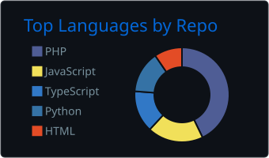
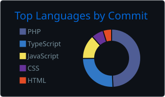
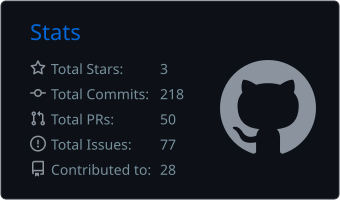
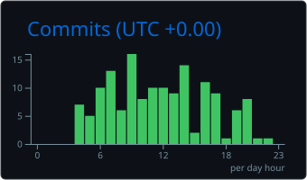

<div align="center">

<pre>
 ██╗      ██████╗ ██╗ ██████╗     ██████╗ ███████╗██╗   ██╗
 ██║     ██╔═══██╗██║██╔════╝     ██╔══██╗██╔════╝██║   ██║
 ██║     ██║   ██║██║██║          ██║  ██║█████╗  ██║   ██║
 ██║     ██║   ██║██║██║          ██║  ██║██╔══╝  ╚██╗ ██╔╝
 ███████╗╚██████╔╝██║╚██████╗     ██████╔╝███████╗ ╚████╔╝
 ╚══════╝ ╚═════╝ ╚═╝ ╚═════╝     ╚═════╝ ╚══════╝  ╚═══╝
</pre>

[](https://git.io/typing-svg)

</div>

---

<div align="center">
<h3><code>> whoami</code></h3>
</div>

<div align="center">

<pre>
┌───────────────────────────────────────────────────────────────┐
│ Name     : Loïc                                               │
│ Role     : Full-Stack Web & Mobile Developer                  │
│ Training : La Plateforme_                                     │
│ Focus    : Web · APIs · Security · Data · Automation          │
│ Stack    : PHP · Symfony · React · Node · Go · Python         │
│ Mission  : Build useful systems and understand how they fail  │
└───────────────────────────────────────────────────────────────┘
</pre>

</div>

Développeur Web & Mobile Full-Stack en formation à **La Plateforme_**, je conçois des applications complètes allant du frontend aux APIs, à la logique métier et aux bases de données.

Je développe également des outils autour de la **cybersécurité**, du **réseau**, de l'**OSINT**, du **Threat Intelligence**, de l'**automatisation** et de l'analyse de données.

---

<div align="center">
<h3><code>> ls -la ./featured-projects</code></h3>
</div>

## 🏆 Projets phares - La Plateforme_

<table>
<thead>
<tr>
<th>Projet</th>
<th>Contexte</th>
<th>Description</th>
<th>Stack</th>
</tr>
</thead>

<tbody>

<tr>
<td>🎬 <b>MarsAI</b></td>
<td><b>Projet de groupe - La Plateforme_</b></td>
<td>
Plateforme autour d'un festival de courts métrages générés par intelligence artificielle.
Projet Full-Stack réalisé en équipe avec intégration frontend/backend et logique applicative.
</td>
<td>
<code>React</code>
<code>Node.js</code>
<code>JavaScript / TypeScript</code>
<code>Tailwind</code>
</td>
</tr>

<tr>
<td>📚 <b>Médiathèque</b></td>
<td><b>Projet de groupe - La Plateforme_</b></td>
<td>
Application de gestion de médiathèque avec architecture métier,
gestion de données relationnelles et attention portée à la sécurité des données.
</td>
<td>
<code>PHP</code>
<code>Symfony</code>
<code>Doctrine</code>
<code>SQL</code>
<code>MVC</code>
</td>
</tr>

<tr>
<td>🧾 <b><a href="https://github.com/loic31000/phase3-symfony-facturation">SaaS Facturation</a></b></td>
<td><b>La Plateforme_ - Symfony</b></td>
<td>
Application de facturation avec gestion des utilisateurs, clients, produits,
factures et lignes de facturation. Dashboard, authentification,
modélisation Doctrine et environnement conteneurisé.
</td>
<td>
<code>Symfony 8</code>
<code>PHP 8.4</code>
<code>Doctrine</code>
<code>PostgreSQL 16</code>
<code>Twig</code>
<code>Tailwind</code>
<code>Docker</code>
<code>PHPUnit</code>
</td>
</tr>

<tr>
<td>✅ <b><a href="https://github.com/loic31000/phase3-symfony-tasklist-reloaded">TaskList Reloaded</a></b></td>
<td><b>La Plateforme_ - Symfony</b></td>
<td>
Application de gestion de tâches avec authentification,
priorités, statuts, tâches épinglées, dossiers et relations utilisateurs/données.
</td>
<td>
<code>Symfony</code>
<code>Doctrine</code>
<code>Auth</code>
<code>CRUD</code>
<code>SQL</code>
</td>
</tr>

<tr>
<td>🔴 <b>Pokédex - évolutions du projet</b></td>
<td><b>La Plateforme_ - JavaScript → Symfony</b></td>
<td>
Déclinaison progressive d'un même sujet au fil de la formation :
d'abord un Pokédex frontend en JavaScript consommant une API externe,
puis une version Symfony avec persistance PostgreSQL, Doctrine,
formulaires et environnement Docker.
<br><br>
<a href="https://github.com/loic31000/PokedexSPA"> → PokedexSPA</a>
&nbsp;·&nbsp;
<a href="https://github.com/loic31000/symfony_pokedex"> → Symfony Pokédex</a>
</td>
<td>
<code>JavaScript</code>
<code>REST API</code>
<code>Symfony 8</code>
<code>PHP 8.4</code>
<code>Doctrine</code>
<code>PostgreSQL</code>
<code>Twig</code>
<code>Tailwind</code>
<code>Docker Compose</code>
</td>
</tr>

<tr>
<td>💬 <b><a href="https://github.com/loic31000/module5-react-threadfront">ThreadFront</a></b></td>
<td><b>Projet de groupe - La Plateforme_</b></td>
<td>
Application sociale Full-Stack avec inscription et connexion JWT,
feed avec scroll infini, création de threads, pages de détail,
profils utilisateurs et gestion sécurisée des sessions.
Architecture entièrement conteneurisée.
</td>
<td>
<code>React 19</code>
<code>React Router</code>
<code>Vite</code>
<code>Node.js</code>
<code>Express 5</code>
<code>Sequelize</code>
<code>MySQL 8</code>
<code>JWT</code>
<code>bcrypt</code>
<code>Docker Compose</code>
<code>Apache</code>
</td>
</tr>

<tr>
<td>🌍 <b><a href="https://github.com/loic31000/Earth-Defender-Project">Earth Defender</a></b></td>
<td><b>La Plateforme_ - TypeScript / Game Dev</b></td>
<td>
Jeu d'arcade spatial où le joueur protège la Terre contre des vagues
d'astéroïdes et d'envahisseurs. Gestion du score, vies, vagues,
projectiles, collisions et entités orientées objet.
</td>
<td>
<code>TypeScript</code>
<code>HTML5 Canvas</code>
<code>OOP</code>
<code>CSS3</code>
<code>Docker</code>
<code>Apache</code>
</td>
</tr>

</tbody>
</table>

---

## 🔐 Projets personnels & cybersécurité

<table>
<thead>
<tr>
<th>Projet</th>
<th>Description</th>
<th>Stack / Concepts</th>
</tr>
</thead>

<tbody>

<tr>
<td>🛡️ <b><a href="https://github.com/loic31000/CyberHub">CyberHub</a></b></td>
<td>
Application locale de veille et d'investigation regroupant IOC, CVE,
CISA KEV, MITRE ATT&CK, BGP/AS, OSINT, playbooks de réponse à incident,
investigations et corrélation de données.
</td>
<td>
<code>Go</code>
<code>React</code>
<code>TypeScript</code>
<code>SQLite</code>
<code>CTI</code>
<code>MITRE ATT&CK</code>
</td>
</tr>

<tr>
<td>🌐 <b><a href="https://github.com/loic31000/bgp-hijack-orange-2026">BGP Hijack Investigation</a></b></td>
<td>
Investigation indépendante et documentation technique d'un événement
de routage BGP visant des ressources associées à Orange France.
Analyse de routes, ASN, visibilité réseau et chronologie technique.
</td>
<td>
<code>BGP</code>
<code>RPKI</code>
<code>RIPEstat</code>
<code>ASN</code>
<code>OSINT</code>
</td>
</tr>

<tr>
<td>📡 <b><a href="https://github.com/loic31000/bgp-monitor-orange-hijack">BGP Monitor</a></b></td>
<td>
Outil Python de monitoring passif via RIPEstat avec analyse d'origines ASN,
historique, alertes, logs persistants et rapports HTML automatisés.
</td>
<td>
<code>Python</code>
<code>RIPEstat API</code>
<code>BGP</code>
<code>ASN</code>
<code>HTML Reports</code>
</td>
</tr>

<tr>
<td>📚 <b><a href="https://github.com/loic31000/AniRecap">AniRecap</a></b></td>
<td>
Application Symfony de consultation et gestion privée de contenus anime/manga
avec authentification, catalogue, saisons, épisodes, chapitres,
personnages, favoris, uploads protégés et contrôle d'accès.
</td>
<td>
<code>Symfony</code>
<code>PHP 8.4</code>
<code>Doctrine</code>
<code>MySQL</code>
<code>Twig</code>
<code>Stimulus</code>
<code>PHPUnit</code>
</td>
</tr>

<tr>
<td>🐍 <b><a href="https://github.com/loic31000/FileRenamer">FileRenamer</a></b></td>
<td>
Application Python permettant de renommer et organiser
des fichiers multimédias en masse.
</td>
<td>
<code>Python</code>
</td>
</tr>

</tbody>
</table>

---

<div align="center">
<h3><code>> cat ./experience.log</code></h3>
</div>

```text
2025 ─ 2026
La Plateforme_
Développeur Web & Applications - Bootcamp intensif

→ Applications Full-Stack
→ JavaScript / TypeScript / React / Node.js
→ PHP / Symfony 8
→ APIs REST & JWT
→ Doctrine ORM / Sequelize
→ MySQL / PostgreSQL / SQLite
→ Docker / Docker Compose
→ Git & GitHub
→ Tests PHPUnit
→ Travail en équipe
→ Méthode Agile
→ Automatisation n8n
→ Intégration IA / LLM

Projets :
→ MarsAI
→ Médiathèque
→ SaaS Facturation
→ TaskList Reloaded
→ Pokédex Symfony
→ ThreadFront
→ Earth Defender
```

---

<div align="center">
<h3><code>> cat ./cyber-focus.md</code></h3>
</div>

<table>

<tr>
<td>🌐</td>
<td><b>Network Security</b></td>
<td>BGP · ASN · routing · RPKI · RIPEstat</td>
</tr>

<tr>
<td>🎯</td>
<td><b>Threat Intelligence</b></td>
<td>IOC · CVE · CISA KEV · EPSS · threat feeds</td>
</tr>

<tr>
<td>🧠</td>
<td><b>Knowledge Mapping</b></td>
<td>MITRE ATT&CK · techniques · tactics · playbooks</td>
</tr>

<tr>
<td>🔍</td>
<td><b>Investigation</b></td>
<td>OSINT · CTI · timelines · correlation · technical research</td>
</tr>

<tr>
<td>⛓️</td>
<td><b>On-chain Analysis</b></td>
<td>Wallet activity · transaction tracing · DeFi flows · OSINT</td>
</tr>

<tr>
<td>🔐</td>
<td><b>Application Security</b></td>
<td>Authentication · authorization · JWT · bcrypt · secure data handling</td>
</tr>

</table>

---

<div align="center">
<h3><code>> cat ./stack.json</code></h3>
</div>

### Frontend


### Backend


### Data & ORM


### Security & Networking


### Testing & Architecture


### Tools & DevOps


---

<div align="center">
<h3><code>> ./github --stats</code></h3>
</div>

<!-- Stats générées automatiquement par GitHub Actions -->

<p align="center">
  
</p>

<p align="center">
  
  
</p>

<p align="center">
  
  
</p>

---

<div align="center">
<h3><code>> grep "mindset" ./brain -r</code></h3>

<pre>
+ Comprendre avant d'automatiser.
+ Observer avant de conclure.
+ Penser comme un attaquant pour construire comme un défenseur.
+ La sécurité n'est pas une feature ajoutée à la fin.

  [ RECON ] ──► [ BUILD ] ──► [ TEST ] ──► [ ANALYZE ] ──► [ HARDEN ]
</pre>

</div>

---

<div align="center">

<h3><code>> ./connect.sh</code></h3>

[](https://github.com/loic31000)

</div>


